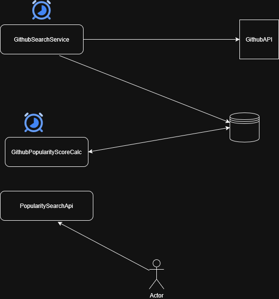

###  Below is the simplified technical diagram

There are 3 major modules. 
- First one is a Searchservice ( running behind a scheduler)
which invokes GitHub search api and fetches parameters and create entries in database.
  - The GitHub search api is paginated and should be utilized to fetch multiple pages. 
  - GitHub api has rate limiting since using free version hence has created a basic throttler class
    which works well with a single instance concept.
- Second module is GithubRepoPopularity calculator which also runs behind a scheduler. The task 
of this module is to pick all repos which has no score assigned and assign score to them.
  - As per the tasks these are the parameters that should be considered are stars, forks and recency.
    I first used updatedAt date from the GitHub search api but quickly found out even when you make a archieve 
    a repo the updatedAt is changed. So instead decided to go with pushedAt date.
  - The popularity calculation is inspired by  ranking calculation for reddit, stackoverflow etc
- Third module is an api interface which allows users to fetch popular GitHub repos and also 
  could update popularityScore.

### Choice of Database
  - I decided to go here with nosql database since I am currently dealing with unstructured data
    for evaluation of popularity. Currently, we have only 3 params and in the future might be more 
    GitHub params adjusted and hence choose mongodb (could have also been elasticsearch )

####  Note:
  - Currently, I have also not created a scheduler lock which might be crucial when you have
    pods running, and you want to assign a job to one particular leader
  - Currently, the user is able to update a score of the GitHub repository that he can search via repoCreatedAt and language
  - For simplicity whenever a GitHub repo fields are updated such as (stars or pushedAt etc) currently we are not re-fetching using search api
    since it could be cumbersome. 
